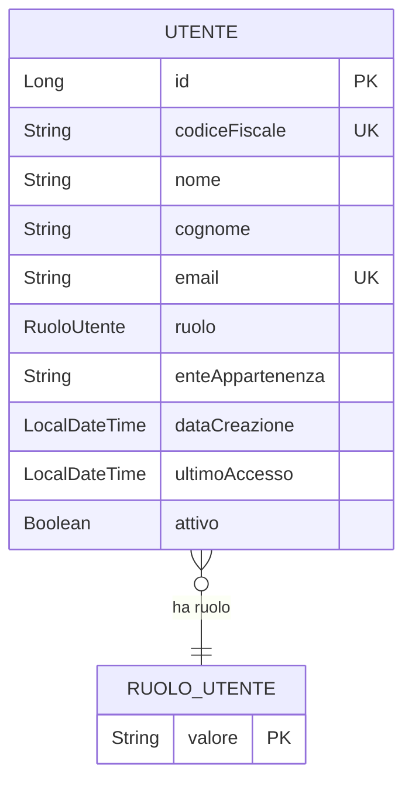
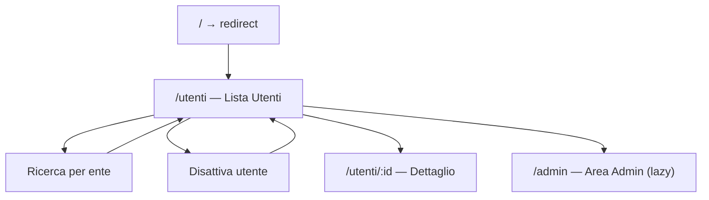

# Specifica Funzionale — Test Project

## 1. Introduzione

### 1.1 Scopo del documento
Il presente documento descrive le specifiche funzionali del sistema **Gestione Utenti PA**, un'applicazione web per la gestione anagrafica degli utenti appartenenti ad enti della Pubblica Amministrazione. Il documento è destinato ai responsabili di progetto, ai team di sviluppo e agli utenti finali.

### 1.2 Ambito del sistema
Il sistema consente la registrazione, la consultazione, la modifica e la disattivazione degli utenti PA. Ogni utente è collegato a un ente di appartenenza e dispone di un ruolo che ne determina i privilegi di accesso. Il sistema espone un'API RESTful consumata da un frontend Angular.

### 1.3 Riferimenti
- Analisi strutturale del progetto: `docgen_context.md`
- Codice sorgente: `backend/`, `frontend/`

### 1.4 Glossario

| Termine | Definizione |
|---|---|
| Utente PA | Dipendente o collaboratore di un ente della Pubblica Amministrazione registrato nel sistema |
| Codice Fiscale | Identificativo univoco del cittadino italiano, usato come chiave di ricerca alternativa |
| Ente di appartenenza | Organismo della PA a cui l'utente è associato |
| Soft delete | Disattivazione logica: l'utente viene marcato come non attivo senza essere rimosso dal database |
| Ruolo | Profilo di autorizzazione assegnato all'utente (AMMINISTRATORE, OPERATORE, DIRIGENTE, CONSULTATORE) |
| JWT | JSON Web Token, meccanismo di autenticazione stateless |

---

## 2. Descrizione generale del sistema

### 2.1 Panoramica
Il sistema **Gestione Utenti PA** è un'applicazione web full-stack che permette agli operatori autenticati di gestire il registro degli utenti della Pubblica Amministrazione. Il backend espone API REST sviluppate con Spring Boot; il frontend è una Single Page Application (SPA) sviluppata con Angular 17.

Le funzionalità principali sono:
- Gestione anagrafica degli utenti PA (creazione, lettura, aggiornamento, disattivazione)
- Ricerca per codice fiscale e per ente di appartenenza
- Differenziazione degli accessi per ruolo
- Tracciamento degli accessi degli utenti

### 2.2 Utenti e attori del sistema

| Attore | Descrizione |
|---|---|
| **AMMINISTRATORE** | Ha accesso completo a tutte le funzionalità del sistema, inclusa la gestione dei ruoli |
| **OPERATORE** | Può creare, modificare e consultare utenti dell'ente di appartenenza |
| **DIRIGENTE** | Accesso in lettura e possibilità di consultare report e liste utenti del proprio ente |
| **CONSULTATORE** | Accesso in sola lettura; può consultare dati degli utenti |

### 2.3 Vincoli e assunzioni
- Ogni utente è identificato univocamente dal codice fiscale (16 caratteri, uppercase).
- L'email deve essere unica nel sistema.
- La cancellazione è sempre logica (soft delete): il campo `attivo` viene impostato a `false`.
- Il sistema richiede autenticazione JWT per l'accesso alle API.
- Il database di riferimento è PostgreSQL; lo schema deve essere pre-esistente (DDL: `validate`).

---

## 3. Requisiti funzionali

**[FUN-001] Visualizzazione lista utenti attivi**
- Descrizione: Il sistema deve restituire la lista di tutti gli utenti con `attivo = true`.
- Attore: OPERATORE, DIRIGENTE, CONSULTATORE, AMMINISTRATORE
- Pre-condizioni: L'utente ha effettuato l'accesso con credenziali valide.
- Flusso principale: L'attore accede alla schermata principale; il sistema interroga il database e restituisce la lista degli utenti attivi.
- Post-condizioni: La lista viene visualizzata con campi: codice fiscale, nome, cognome, email, ruolo, ente.
- Priorità: Alta

**[FUN-002] Ricerca utente per codice fiscale**
- Descrizione: Consentire la ricerca di un singolo utente tramite il suo codice fiscale.
- Attore: OPERATORE, DIRIGENTE, CONSULTATORE, AMMINISTRATORE
- Pre-condizioni: L'utente è autenticato.
- Flusso principale: L'attore inserisce un codice fiscale; il sistema normalizza il valore in uppercase e restituisce il record corrispondente o un errore 404.
- Post-condizioni: Viene visualizzato il dettaglio dell'utente, oppure un messaggio di "non trovato".
- Priorità: Alta

**[FUN-003] Ricerca utenti per ente di appartenenza**
- Descrizione: Consentire la ricerca degli utenti filtrando per ente di appartenenza (ricerca parziale, case-insensitive).
- Attore: OPERATORE, DIRIGENTE, CONSULTATORE, AMMINISTRATORE
- Pre-condizioni: L'utente è autenticato.
- Flusso principale: L'attore inserisce una stringa di ricerca; il sistema restituisce tutti gli utenti il cui ente contiene la stringa cercata.
- Post-condizioni: Viene visualizzata la lista filtrata.
- Priorità: Alta

**[FUN-004] Creazione nuovo utente**
- Descrizione: Consentire la registrazione di un nuovo utente PA nel sistema.
- Attore: OPERATORE, AMMINISTRATORE
- Pre-condizioni: L'utente è autenticato; il codice fiscale e l'email non devono essere già presenti nel sistema.
- Flusso principale: L'attore compila il form con i dati dell'utente; il sistema valida i dati, verifica l'unicità del codice fiscale e salva il record con `attivo = true` e `dataCreazione` impostata automaticamente.
- Post-condizioni: L'utente viene creato e restituito con HTTP 201.
- Priorità: Alta

**[FUN-005] Modifica utente esistente**
- Descrizione: Consentire la modifica dei dati anagrafici di un utente esistente.
- Attore: OPERATORE, AMMINISTRATORE
- Pre-condizioni: L'utente target deve esistere nel sistema.
- Flusso principale: L'attore seleziona un utente, modifica i campi desiderati (nome, cognome, email, ruolo, ente) e salva le modifiche.
- Post-condizioni: Il record viene aggiornato; il codice fiscale e la data di creazione rimangono immutati.
- Priorità: Alta

**[FUN-006] Disattivazione utente (soft delete)**
- Descrizione: Consentire la disattivazione logica di un utente senza rimozione fisica dal database.
- Attore: OPERATORE, AMMINISTRATORE
- Pre-condizioni: L'utente target deve esistere e deve essere attivo.
- Flusso principale: L'attore conferma la disattivazione; il sistema imposta `attivo = false` e salva il record.
- Post-condizioni: L'utente non appare più nella lista degli utenti attivi; HTTP 204 restituito.
- Priorità: Alta

**[FUN-007] Consultazione dettaglio utente per ID**
- Descrizione: Consentire il recupero del dettaglio di un utente tramite ID numerico.
- Attore: OPERATORE, DIRIGENTE, CONSULTATORE, AMMINISTRATORE
- Pre-condizioni: L'utente è autenticato; l'ID deve essere un intero valido.
- Flusso principale: Il sistema recupera il record con l'ID specificato e lo restituisce.
- Post-condizioni: Il dettaglio utente viene restituito oppure HTTP 404 se non trovato.
- Priorità: Media

**[FUN-008] Tracciamento ultimo accesso**
- Descrizione: Il sistema registra automaticamente la data e l'ora dell'ultima autenticazione dell'utente.
- Attore: Sistema (automatico)
- Pre-condizioni: L'utente ha effettuato il login con successo.
- Flusso principale: All'autenticazione riuscita, il sistema aggiorna il campo `ultimoAccesso`.
- Post-condizioni: Il campo `ultimoAccesso` è aggiornato al timestamp corrente.
- Priorità: Media

---

## 4. Casi d'uso dettagliati

### UC-001: Creazione di un nuovo utente
- **Attore**: OPERATORE o AMMINISTRATORE
- **Precondizioni**: L'attore è autenticato. Non esiste nel sistema un utente con lo stesso codice fiscale o la stessa email.
- **Flusso principale**:
  1. L'attore invia una richiesta POST `/api/utenti` con i dati dell'utente.
  2. Il sistema valida i campi obbligatori (nome, cognome, email, codiceFiscale, ruolo) tramite Bean Validation (`@Valid`).
  3. Il service verifica l'unicità del codice fiscale tramite `findByCodiceFiscale`.
  4. Il sistema imposta `dataCreazione = now()` tramite `@PrePersist`.
  5. Il record viene persistito nel database.
  6. Il sistema restituisce HTTP 201 con il body dell'utente creato.
- **Flussi alternativi**:
  - [3a] Codice fiscale già presente: il service lancia `IllegalArgumentException`; il sistema restituisce errore con messaggio "Utente con codice fiscale … già esistente".
  - [2a] Dati di input invalidi (campi mancanti, formato email errato): Bean Validation restituisce HTTP 400 con i dettagli degli errori di validazione.
- **Eccezioni**:
  - Database non raggiungibile → HTTP 500 (errore interno non gestito esplicitamente).
- **Postcondizioni**: Il nuovo utente è presente nel database con `attivo = true`.

---

### UC-002: Disattivazione utente
- **Attore**: OPERATORE o AMMINISTRATORE
- **Precondizioni**: L'attore è autenticato. L'utente target esiste nel sistema.
- **Flusso principale**:
  1. L'attore preme il pulsante "Disattiva" nella lista utenti.
  2. Il frontend mostra una richiesta di conferma (`window.confirm`).
  3. L'attore conferma l'operazione.
  4. Il frontend invia DELETE `/api/utenti/{id}`.
  5. Il service recupera l'utente per ID, imposta `attivo = false` e salva.
  6. Il sistema restituisce HTTP 204 No Content.
  7. Il frontend ricarica la lista utenti.
- **Flussi alternativi**:
  - [2a] L'attore annulla la conferma: nessuna operazione viene eseguita.
  - [5a] L'utente con l'ID specificato non è trovato: il service lancia `IllegalArgumentException`; il sistema restituisce HTTP 500.
- **Eccezioni**:
  - Errore di rete → il frontend visualizza "Errore nella disattivazione".
- **Postcondizioni**: L'utente ha `attivo = false` nel database e non appare più nella lista degli utenti attivi.

---

### UC-003: Modifica dei dati anagrafici di un utente
- **Attore**: OPERATORE o AMMINISTRATORE
- **Precondizioni**: L'attore è autenticato. L'utente target esiste con l'ID fornito.
- **Flusso principale**:
  1. L'attore invia PUT `/api/utenti/{id}` con i nuovi dati.
  2. Il sistema valida i campi tramite `@Valid`.
  3. Il service recupera il record esistente per ID.
  4. Vengono aggiornati i campi: nome, cognome, email, ruolo, enteAppartenenza.
  5. Il record viene salvato nel database.
  6. Il sistema restituisce HTTP 200 con il body aggiornato.
- **Flussi alternativi**:
  - [3a] ID non trovato: il service lancia `IllegalArgumentException`; il sistema restituisce errore.
  - [2a] Dati di input invalidi: Bean Validation restituisce HTTP 400.
- **Eccezioni**:
  - Violazione di unicità email nel database → errore di constraint JDBC non gestito esplicitamente.
- **Postcondizioni**: Il record è aggiornato nel database. Campi immutabili (id, codiceFiscale, dataCreazione) rimangono invariati.

---

### UC-004: Ricerca utenti per ente di appartenenza
- **Attore**: Qualsiasi utente autenticato
- **Precondizioni**: L'attore è autenticato.
- **Flusso principale**:
  1. L'attore inserisce una stringa nel campo di ricerca della lista utenti e preme Invio o il pulsante "Cerca".
  2. Il frontend invia GET `/api/utenti/ente/{ente}`.
  3. Il service esegue una query `CONTAINING IGNORE CASE` sul campo `enteAppartenenza`.
  4. Il sistema restituisce la lista filtrata.
- **Flussi alternativi**:
  - [1a] La stringa di ricerca è vuota: il frontend ricarica la lista completa degli utenti attivi (FUN-001).
  - [4a] Nessun utente trovato: viene restituita una lista vuota e il frontend mostra "Nessun utente trovato".
- **Eccezioni**:
  - Errore di rete → il frontend visualizza "Errore nella ricerca".
- **Postcondizioni**: La lista visualizzata è filtrata in base all'ente cercato.

---

## 5. Modello dati funzionale

### Entità principali

**Utente** — Rappresenta un dipendente o collaboratore di un ente PA registrato nel sistema.

| Campo | Tipo funzionale | Obbligatorio | Note |
|---|---|---|---|
| ID | Identificativo numerico | Sì (autogenerato) | Chiave primaria interna |
| Codice Fiscale | Stringa 16 caratteri | Sì | Identificativo univoco del cittadino; immutabile dopo la creazione |
| Nome | Testo | Sì | |
| Cognome | Testo | Sì | |
| Email | Indirizzo email | Sì | Deve essere unica nel sistema |
| Ruolo | Enumerazione | Sì | Determina i privilegi di accesso |
| Ente di Appartenenza | Testo | No | Organismo PA di riferimento |
| Data Creazione | Data e ora | Sì (autogenerata) | Impostata automaticamente alla creazione |
| Ultimo Accesso | Data e ora | No | Aggiornato ad ogni autenticazione |
| Attivo | Booleano | Sì | `true` = utente attivo; `false` = utente disattivato |

**RuoloUtente** — Enumerazione dei profili di accesso disponibili:

| Valore | Descrizione |
|---|---|
| AMMINISTRATORE | Accesso completo a tutti i dati e funzionalità |
| OPERATORE | Gestione operativa degli utenti del proprio ente |
| DIRIGENTE | Consultazione e report; lettura avanzata |
| CONSULTATORE | Sola lettura |

### Diagramma ER

---

## 6. Interfaccia utente

### Schermate principali

**Schermata principale — Lista Utenti (`/utenti`)**
- Visualizza la tabella degli utenti attivi con colonne: Codice Fiscale, Nome, Cognome, Email, Ruolo, Ente, Azioni.
- Include una barra di ricerca per filtrare per ente di appartenenza (ricerca attivata da tasto Invio o pulsante "Cerca").
- Il pulsante "Disattiva" richiede conferma e aggiorna la lista automaticamente.
- Gestisce gli stati di caricamento (`loading`) e di errore (`errorMessage`).
- Se non vi sono utenti, mostra il messaggio "Nessun utente trovato."

**Schermata dettaglio utente (`/utenti/:id`)**
- Da completare — informazioni non rilevabili dal codice sorgente (il routing è presente ma il componente non gestisce parametri ID nel codice analizzato).

**Area amministrativa (`/admin`)**
- Da completare — modulo lazy-loaded; contenuto non rilevabile dal codice sorgente.

### Flusso di navigazione

---

## 7. Integrazioni e interfacce esterne

### Backend → Database
Il backend si connette a un'istanza PostgreSQL tramite JDBC. La URL di connessione è `jdbc:postgresql://localhost:5432/utenti_pa` (configurabile via variabili d'ambiente).

### Frontend → Backend
Il frontend Angular comunica con il backend tramite HTTP REST (`HttpClient`). La URL base dell'API è configurabile tramite `environment.apiUrl`.

### Autenticazione esterna
Il sistema utilizza JWT per l'autenticazione. La generazione e la validazione del token sono gestite da Spring Security con la libreria `jjwt-api`. Non è presente integrazione con sistemi SSO, SPID o LDAP nel codice analizzato.

---

## 8. Regole di business

### RB-001: Unicità del codice fiscale
- **Descrizione**: Non possono esistere due utenti con lo stesso codice fiscale nel sistema.
- **Implementazione**: `UtenteService.creaUtente()` — verifica con `findByCodiceFiscale` prima del salvataggio; colonna DB con vincolo `UNIQUE`.
- **Vincolo**: Se violata, viene lanciata una `IllegalArgumentException` con messaggio "Utente con codice fiscale … già esistente".
- **Impatto**: UC-001 (Creazione utente).

### RB-002: Unicità dell'email
- **Descrizione**: Ogni utente deve avere un indirizzo email univoco nel sistema.
- **Implementazione**: Vincolo `@Column(unique = true)` sull'entità `Utente` — gestito a livello di database.
- **Vincolo**: Violazione del constraint database; l'eccezione non è gestita esplicitamente a livello applicativo.
- **Impatto**: UC-001, UC-003.

### RB-003: Soft delete obbligatorio
- **Descrizione**: Gli utenti non vengono mai eliminati fisicamente dal database; vengono marcati con `attivo = false`.
- **Implementazione**: `UtenteService.disattivaUtente()` — imposta `attivo = false` e salva il record.
- **Vincolo**: Non è possibile effettuare un hard delete tramite le API esposte.
- **Impatto**: UC-002 (Disattivazione utente), FUN-001 (la lista mostra solo `attivo = true`).

### RB-004: Codice fiscale in maiuscolo
- **Descrizione**: Il codice fiscale viene normalizzato in uppercase durante le operazioni di ricerca.
- **Implementazione**: `UtenteService.findByCodiceFiscale()` chiama `.toUpperCase()` sul parametro prima della query.
- **Vincolo**: Input in minuscolo viene accettato ma normalizzato automaticamente.
- **Impatto**: FUN-002 (Ricerca per codice fiscale).

### RB-005: Campi immutabili alla modifica
- **Descrizione**: In fase di aggiornamento, il codice fiscale e la data di creazione non sono modificabili.
- **Implementazione**: `UtenteService.aggiornaUtente()` — solo nome, cognome, email, ruolo e ente vengono sovrascritti dal payload.
- **Vincolo**: L'attore non può alterare l'identità fiscale dell'utente dopo la creazione.
- **Impatto**: UC-003 (Modifica utente).

### RB-006: Data creazione automatica
- **Descrizione**: La data di creazione viene impostata automaticamente dal sistema al momento della prima persistenza.
- **Implementazione**: Metodo `@PrePersist onCreate()` nell'entità `Utente`.
- **Vincolo**: Non è possibile per il client specificare o sovrascrivere la data di creazione.
- **Impatto**: UC-001 (Creazione utente).

### RB-007: Lista utenti filtra solo attivi
- **Descrizione**: La chiamata GET `/api/utenti` restituisce solo gli utenti con `attivo = true`.
- **Implementazione**: `UtenteService.findAllAttivi()` — query `findByAttivoTrue()`.
- **Vincolo**: Gli utenti disattivati non sono visibili nella lista standard.
- **Impatto**: FUN-001, UC-002.

---

## 9. Requisiti non funzionali

### 9.1 Prestazioni
- Le API REST devono rispondere in tempi adeguati per operazioni CRUD su tabelle di dimensione tipica della PA.
- Le query di ricerca per ente utilizzano `CONTAINING IGNORE CASE`, che può degradare le prestazioni su grandi dataset in assenza di indici appropriati sul campo `ente_appartenenza`.
- Da completare — requisiti specifici di SLA non rilevabili dal codice sorgente.

### 9.2 Sicurezza
- L'accesso alle API REST è protetto da autenticazione JWT, gestita da Spring Security.
- Il segreto JWT è configurato tramite variabile d'ambiente `JWT_SECRET` (non hardcoded).
- Le credenziali del database sono parametrizzate (`DB_USERNAME`, `DB_PASSWORD`) ma i valori di default in `application.yml` sono `admin/admin` — da eliminare in produzione.
- DDL impostato a `validate`: lo schema non viene alterato automaticamente dall'applicazione.

### 9.3 Usabilità
- Il frontend fornisce feedback visivo durante il caricamento (`loading`) e in caso di errore (`errorMessage`).
- Le operazioni distruttive (disattivazione) richiedono conferma esplicita (`window.confirm`).
- Da completare — standard di accessibilità (WCAG) e usabilità non rilevabili dal codice sorgente.

### 9.4 Disponibilità
- Da completare — requisiti di uptime, failover e disaster recovery non rilevabili dal codice sorgente.

---

## 10. Appendici

### 10.1 Matrice funzionalità-componenti

| Requisito | Backend Controller | Backend Service | Frontend Component | Frontend Service |
|---|---|---|---|---|
| FUN-001 Lista utenti | `GET /api/utenti` | `findAllAttivi()` | `UtentiListComponent.loadUtenti()` | `UtenteService.getAll()` |
| FUN-002 Ricerca per CF | `GET /api/utenti/cf/{cf}` | `findByCodiceFiscale()` | — | `UtenteService.getByCodiceFiscale()` |
| FUN-003 Ricerca per ente | `GET /api/utenti/ente/{ente}` | `findByEnte()` | `UtentiListComponent.onSearch()` | `UtenteService.searchByEnte()` |
| FUN-004 Creazione utente | `POST /api/utenti` | `creaUtente()` | — | `UtenteService.create()` |
| FUN-005 Modifica utente | `PUT /api/utenti/{id}` | `aggiornaUtente()` | — | `UtenteService.update()` |
| FUN-006 Disattivazione | `DELETE /api/utenti/{id}` | `disattivaUtente()` | `UtentiListComponent.deleteUtente()` | `UtenteService.delete()` |
| FUN-007 Dettaglio per ID | `GET /api/utenti/{id}` | `findById()` | — | `UtenteService.getById()` |
| FUN-008 Tracciamento accesso | — | `registraAccesso()` | — | — |
