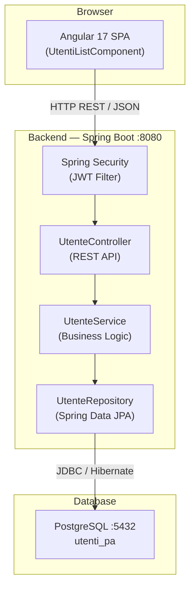
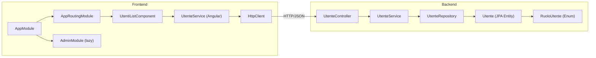
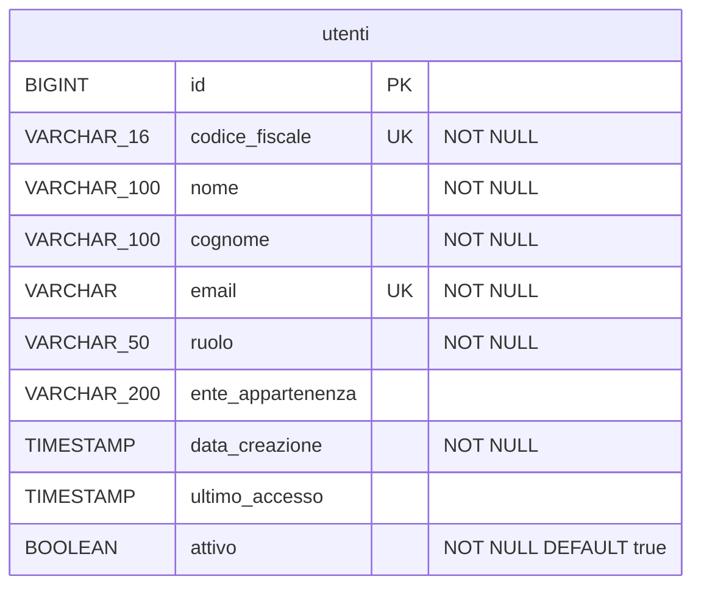

# Specifica Tecnica — Test Project

## 1. Introduzione

### 1.1 Scopo del documento
Il presente documento descrive le specifiche tecniche del sistema **Gestione Utenti PA**, fornendo una visione dettagliata dell'architettura, dello stack tecnologico, delle API REST, del modello dati fisico, della configurazione e delle procedure di deployment.

### 1.2 Ambito del sistema
Il sistema è composto da un backend REST sviluppato con Spring Boot e un frontend SPA sviluppato con Angular 17. Il backend persiste i dati su un database relazionale PostgreSQL.

### 1.3 Riferimenti
- Analisi strutturale del progetto: `docgen_context.md`
- Specifica Funzionale: `specifica_funzionale.md`
- Codice sorgente: `backend/`, `frontend/`

### 1.4 Glossario tecnico

| Termine | Definizione |
|---|---|
| SPA | Single Page Application — applicazione web che gestisce il routing lato client |
| REST | Representational State Transfer — stile architetturale per API HTTP |
| JPA | Java Persistence API — specifica per ORM in Java |
| JWT | JSON Web Token — standard RFC 7519 per token di autenticazione stateless |
| DDL | Data Definition Language — istruzioni SQL per la struttura dello schema |
| ORM | Object-Relational Mapping — mappatura tra classi Java e tabelle DB |
| Bean Validation | Standard JSR-380 per la validazione dichiarativa dei dati in Java |

---

## 2. Architettura del sistema

### 2.1 Architettura generale
Il sistema segue un'architettura **client-server a tre layer**:
- **Presentation Layer**: SPA Angular 17 eseguita nel browser dell'utente
- **Application Layer**: Spring Boot 3.x con Spring MVC, Spring Security, Spring Data JPA
- **Data Layer**: PostgreSQL 14+



### 2.2 Pattern architetturali
- **Layered Architecture**: Controller → Service → Repository, con separazione netta delle responsabilità.
- **Repository Pattern**: `UtenteRepository` incapsula l'accesso al database tramite Spring Data JPA.
- **Dependency Injection**: Spring IoC gestisce l'iniezione delle dipendenze via costruttore (constructor injection).
- **Entità JPA come DTO**: Il corpo delle richieste HTTP utilizza direttamente l'entità JPA (`Utente`) — assenza di un layer DTO dedicato (debito tecnico).
- **Soft Delete**: Le eliminazioni sono logiche; il record rimane nel DB con `attivo = false`.

### 2.3 Diagramma dei componenti



---

## 3. Stack tecnologico

| Tecnologia | Versione | Scopo |
|---|---|---|
| Java | 17+ (inferito da Spring Boot 3) | Runtime backend |
| Spring Boot | 3.x (inferito da namespace `jakarta.*`) | Framework applicativo backend |
| Spring MVC | incluso in Spring Boot | Esposizione API REST |
| Spring Security | incluso in Spring Boot | Autenticazione e autorizzazione JWT |
| Spring Data JPA | incluso in Spring Boot | Accesso al database via ORM |
| Hibernate | incluso in Spring Data JPA | Implementazione JPA/ORM |
| PostgreSQL Driver | 42.7.1 | Driver JDBC per PostgreSQL |
| MapStruct | 1.5.5.Final | Mapping entità-DTO (dipendenza presente, utilizzo non rilevato nel codice analizzato) |
| jjwt-api | 0.12.3 | Generazione e validazione JWT |
| Jakarta Validation | incluso in Spring Boot Validation | Bean Validation JSR-380 |
| PostgreSQL | 14+ (inferito) | Database relazionale |
| Angular | 17.0.0 | Framework frontend SPA |
| Angular Material | 17.0.0 | Componenti UI |
| Angular Router | 17.0.0 | Routing client-side |
| RxJS | ~7.8.0 | Programmazione reattiva (Observable) |
| TypeScript | ~5.2.0 | Linguaggio di sviluppo frontend |
| Zone.js | ~0.14.0 | Change detection Angular |
| Node.js / npm | LTS (inferito) | Build tool frontend |
| Angular CLI | 17.0.0 | Scaffolding e build frontend |
| Maven | 3.8+ (inferito) | Build tool backend |

---

## 4. Dettaglio backend

### 4.1 Struttura dei package

```
it.gov.protocollo
├── controller/
│   └── UtenteController.java      — Endpoint REST /api/utenti
├── service/
│   └── UtenteService.java         — Logica di business, gestione transazioni
├── entity/
│   ├── Utente.java                — Entità JPA mappata sulla tabella "utenti"
│   └── RuoloUtente.java           — Enum ruoli utente
└── repository/
    └── UtenteRepository.java      — Interfaccia Spring Data JPA (inferita)
```

### 4.2 API REST

| Metodo | Endpoint | Descrizione | Handler | Risposta OK |
|---|---|---|---|---|
| GET | `/api/utenti` | Lista tutti gli utenti con `attivo=true` | `getAll()` | 200 + `List<Utente>` |
| GET | `/api/utenti/{id}` | Dettaglio utente per ID numerico | `getById()` | 200 + `Utente` / 404 |
| GET | `/api/utenti/cf/{codiceFiscale}` | Ricerca utente per codice fiscale | `getByCodiceFiscale()` | 200 + `Utente` / 404 |
| POST | `/api/utenti` | Crea nuovo utente (`@Valid @RequestBody`) | `create()` | 201 + `Utente` |
| PUT | `/api/utenti/{id}` | Aggiorna utente esistente (`@Valid @RequestBody`) | `update()` | 200 + `Utente` |
| DELETE | `/api/utenti/{id}` | Disattiva utente (soft delete) | `delete()` | 204 No Content |
| GET | `/api/utenti/ente/{ente}` | Ricerca utenti per ente (parziale, case-insensitive) | `getByEnte()` | 200 + `List<Utente>` |

### 4.3 Modello dati

**Tabella: `utenti`**

| Colonna | Tipo DB | Nullable | Vincoli |
|---|---|---|---|
| `id` | BIGINT | NO | PK, AUTO_INCREMENT (IDENTITY) |
| `codice_fiscale` | VARCHAR(16) | NO | UNIQUE |
| `nome` | VARCHAR(100) | NO | |
| `cognome` | VARCHAR(100) | NO | |
| `email` | VARCHAR(255) | NO | UNIQUE |
| `ruolo` | VARCHAR(50) | NO | CHECK IN enum values |
| `ente_appartenenza` | VARCHAR(200) | YES | |
| `data_creazione` | TIMESTAMP | NO | Impostata con `@PrePersist` |
| `ultimo_accesso` | TIMESTAMP | YES | |
| `attivo` | BOOLEAN | NO | DEFAULT `true` |



**Enum `RuoloUtente`** (persistito come `VARCHAR` via `@Enumerated(EnumType.STRING)`):

| Valore | Descrizione |
|---|---|
| `AMMINISTRATORE` | Accesso completo |
| `OPERATORE` | Gestione operativa |
| `DIRIGENTE` | Lettura avanzata e report |
| `CONSULTATORE` | Sola lettura |

### 4.4 Logica di business

`UtenteService` è annotato `@Service @Transactional`. Le operazioni di sola lettura usano `@Transactional(readOnly = true)` per ottimizzazione della connection pool e riduzione del lock.

| Metodo | Logica |
|---|---|
| `findAllAttivi()` | Query derivata `findByAttivoTrue()` — restituisce solo utenti con `attivo=true` |
| `findById(id)` | `Optional<Utente>` — nessuna business logic aggiuntiva |
| `findByCodiceFiscale(cf)` | Normalizza il CF in uppercase (`toUpperCase()`) prima della query |
| `creaUtente(utente)` | Verifica unicità CF tramite `findByCodiceFiscale`; lancia `IllegalArgumentException` se duplicato |
| `aggiornaUtente(id, dati)` | Recupera esistente per ID (lancia eccezione se assente); aggiorna: nome, cognome, email, ruolo, enteAppartenenza; salva |
| `disattivaUtente(id)` | Recupera per ID (lancia eccezione se assente); imposta `attivo = false`; salva |
| `registraAccesso(id)` | Aggiorna `ultimoAccesso` a `LocalDateTime.now()` tramite `ifPresent` — nessun errore se ID non trovato |
| `findByEnte(ente)` | Query derivata `findByEnteAppartenenzaContainingIgnoreCase(ente)` |

### 4.5 Sicurezza e autenticazione
- Spring Security con filtro JWT è attivo (`spring-boot-starter-security` incluso nel classpath).
- Il secret JWT è obbligatorio e deve essere fornito tramite variabile d'ambiente `JWT_SECRET` (nessun fallback — sicuro per produzione).
- La durata del token è configurata a 86400000 ms (24 ore).
- Le regole di autorizzazione per ruolo (quali endpoint richiedono quale `RuoloUtente`) non sono rilevabili dal codice sorgente analizzato — richiedono la classe `SecurityConfig` (non presente nei file analizzati).

---

## 5. Dettaglio frontend

### 5.1 Struttura dei moduli

```
src/app/
├── app.module.ts                        — Root module
├── app-routing.module.ts                — Routing principale
├── components/
│   └── utenti-list/
│       ├── utenti-list.component.ts     — Componente lista utenti (logica)
│       └── utenti-list.component.html   — Template tabella utenti
├── services/
│   └── utente.service.ts               — Servizio HTTP per API utenti
├── modules/
│   └── admin/
│       └── admin.module.ts             — Modulo admin lazy-loaded (non analizzato)
└── environments/
    └── environment.ts                  — Configurazione URL API (environment.apiUrl)
```

### 5.2 Routing

| Path | Component / Modulo | Strategia | Note |
|---|---|---|---|
| `/` | redirect `/utenti` | Redirect | `pathMatch: 'full'` |
| `/utenti` | `UtentiListComponent` | Eager | Lista utenti attivi |
| `/utenti/:id` | `UtentiListComponent` | Eager | Dettaglio (parametro `:id` non gestito nel codice analizzato) |
| `/admin` | `AdminModule` | Lazy | Caricato su richiesta |
| `**` | redirect `/utenti` | Wildcard | Fallback per rotte sconosciute |

### 5.3 Componenti principali

**`UtentiListComponent`** (selector: `app-utenti-list`)

| Proprietà | Tipo | Descrizione |
|---|---|---|
| `utenti` | `Utente[]` | Array degli utenti caricati dal backend |
| `loading` | `boolean` | Flag di stato caricamento; mostra spinner |
| `errorMessage` | `string` | Messaggio di errore da mostrare all'utente |
| `searchTerm` | `string` | Termine di ricerca per ente inserito dall'utente |

| Metodo | Descrizione |
|---|---|
| `ngOnInit()` | Richiama `loadUtenti()` all'inizializzazione del componente |
| `loadUtenti()` | Chiama `UtenteService.getAll()` e popola `utenti`; gestisce loading/error |
| `onSearch()` | Se `searchTerm` non è vuoto, chiama `searchByEnte()`; altrimenti ricarica la lista completa |
| `deleteUtente(id)` | Richiede conferma con `window.confirm`, poi chiama `UtenteService.delete(id)` e ricarica la lista |

### 5.4 Servizi e comunicazione con il backend

**`UtenteService`** (Angular) — singleton iniettato globalmente (`providedIn: 'root'`).

- Utilizza `HttpClient` per tutte le comunicazioni HTTP con il backend.
- La URL base è `${environment.apiUrl}/api/utenti`.
- Tutti i metodi restituiscono `Observable<T>`.

| Metodo Angular | Metodo HTTP | Endpoint |
|---|---|---|
| `getAll()` | GET | `/api/utenti` |
| `getById(id)` | GET | `/api/utenti/{id}` |
| `getByCodiceFiscale(cf)` | GET | `/api/utenti/cf/{cf}` |
| `create(utente)` | POST | `/api/utenti` |
| `update(id, utente)` | PUT | `/api/utenti/{id}` |
| `delete(id)` | DELETE | `/api/utenti/{id}` |
| `searchByEnte(ente)` | GET | `/api/utenti/ente/{ente}` |

### 5.5 Gestione dello stato
- Lo stato dell'applicazione è gestito localmente nel componente `UtentiListComponent` tramite proprietà di istanza.
- Non è utilizzato alcun sistema di state management centralizzato (NgRx, Akita, ecc.).
- I dati vengono ricaricati via HTTP dopo ogni operazione che modifica lo stato (nessuna cache locale).

---

## 6. Configurazione e deployment

### 6.1 Configurazione applicativa

Il backend è configurato tramite `src/main/resources/application.yml`. Parametri salienti:

| Parametro | Valore / Variabile | Note |
|---|---|---|
| `server.port` | `8080` | Porta HTTP backend |
| `spring.datasource.url` | `jdbc:postgresql://localhost:5432/utenti_pa` | URL JDBC database |
| `spring.datasource.username` | `${DB_USERNAME:admin}` | Variabile d'ambiente con fallback insicuro |
| `spring.datasource.password` | `${DB_PASSWORD:admin}` | **Attenzione**: fallback in chiaro — rimuovere in produzione |
| `spring.jpa.hibernate.ddl-auto` | `validate` | Schema deve essere pre-creato |
| `spring.jpa.show-sql` | `false` | |
| `spring.security.jwt.secret` | `${JWT_SECRET}` | Obbligatorio — nessun fallback (sicuro) |
| `spring.security.jwt.expiration` | `86400000` (ms) | Durata token JWT: 24 ore |
| `logging.level.root` | `INFO` | |
| `logging.level.it.gov.protocollo` | `DEBUG` | Log applicativo dettagliato |

### 6.2 Requisiti di sistema

| Componente | Requisito Minimo |
|---|---|
| JDK | Java 17+ |
| Database | PostgreSQL 14+ |
| Node.js | 18+ (per build frontend) |
| Angular CLI | 17.x |
| Maven | 3.8+ |

### 6.3 Istruzioni di build e deploy

**Backend:**
```bash
cd backend
mvn clean package -DskipTests
java -jar target/gestione-utenti-pa.jar
```

**Frontend:**
```bash
cd frontend
npm install
ng build --configuration production
```

La build del frontend produce una cartella `dist/` da servire tramite web server (nginx, Apache, o CDN statica).

### 6.4 Variabili d'ambiente

| Variabile | Obbligatoria | Descrizione |
|---|---|---|
| `DB_USERNAME` | Sì (in produzione) | Username del database PostgreSQL |
| `DB_PASSWORD` | Sì (in produzione) | Password del database PostgreSQL |
| `JWT_SECRET` | Sì | Chiave segreta per firma e verifica dei token JWT |

---

## 7. Integrazioni esterne

### 7.1 API consumate
Da completare — il sistema non consuma API esterne nel codice analizzato.

### 7.2 Database
- **DBMS**: PostgreSQL 14+
- **Database**: `utenti_pa`
- **Host default**: `localhost:5432`
- **DDL mode**: `validate` — Hibernate verifica che lo schema esistente sia conforme al modello JPA senza effettuare modifiche.
- **Dialect**: `org.hibernate.dialect.PostgreSQLDialect`
- **Gestione migrazioni**: Da completare — Flyway e Liquibase non rilevati nel codice analizzato.

### 7.3 Servizi di autenticazione
- **JWT**: Generazione e validazione con `io.jsonwebtoken:jjwt-api:0.12.3`.
- Il secret è fornito esternamente tramite variabile d'ambiente `JWT_SECRET`.
- La durata del token è 24 ore.
- Integrazione con provider esterni (LDAP, SPID, OAuth2/OIDC): Da completare — non rilevabile dal codice analizzato.

---

## 8. Requisiti non funzionali tecnici

### 8.1 Prestazioni e scalabilità
- Le operazioni di sola lettura usano `@Transactional(readOnly = true)` per ridurre l'overhead sulle transazioni DB.
- La query `findByEnteAppartenenzaContainingIgnoreCase` esegue una `LIKE '%...%'` case-insensitive — può degradare su dataset grandi senza indice full-text o GIN su `ente_appartenenza`.
- La paginazione non è implementata: `findAllAttivi()` restituisce tutti i record senza limite — rischio di OOM su volumi elevati.
- Scalabilità orizzontale: Da completare — nessuna configurazione di sticky session o cache distribuita rilevata.

### 8.2 Logging e monitoraggio
- Framework di logging: SLF4J + Logback (inclusi in Spring Boot).
- Package `it.gov.protocollo` logga a livello `DEBUG`.
- Root logger a livello `INFO`.
- Da completare — nessun sistema di monitoraggio (Spring Actuator, Prometheus, ELK) configurato nel codice analizzato.

### 8.3 Gestione errori
- Il controller restituisce `ResponseEntity.notFound().build()` (HTTP 404) per ricerche per ID o CF senza risultato.
- Le eccezioni `IllegalArgumentException` del service non sono gestite da `@ControllerAdvice` — propagano come HTTP 500 (vedere sezione 11).
- Il frontend gestisce gli errori tramite il blocco `error` del subscribe RxJS con messaggi statici.

### 8.4 Testing
- Da completare — nessun test unitario o di integrazione presente nel codice sorgente analizzato.

---

## 9. Flussi asincroni e integrazioni event-driven

Da completare — il sistema non utilizza code di messaggi, pub/sub, webhook o event bus nel codice analizzato. Tutte le comunicazioni sono sincrone (HTTP request/response).

---

## 10. Gestione errori e codici di stato

### 10.1 Strategia di error handling
- **Controller level**: uso esplicito di `ResponseEntity` con codici HTTP appropriati (200, 201, 204, 404).
- **Service level**: `IllegalArgumentException` per violazioni di business rule (CF duplicato, ID non trovato).
- **Assenza di `@ControllerAdvice` globale**: le eccezioni non gestite propagano come HTTP 500 con stacktrace (potenziale information leakage in produzione).
- **Frontend**: blocco `error` nel subscribe RxJS con messaggi statici — nessuna granularità sul codice HTTP di errore.

### 10.2 Catalogo errori

| Codice | Messaggio | Contesto | HTTP Status di fatto |
|---|---|---|---|
| — | "Utente con codice fiscale {CF} già esistente" | Creazione utente con CF duplicato | 500 (non gestito con ControllerAdvice) |
| — | "Utente non trovato: {id}" | Aggiornamento o disattivazione con ID inesistente | 500 (non gestito) |
| — | Standard Spring Security | Accesso senza token o token non valido | 401 / 403 |
| — | Standard Bean Validation | Dati di input non validi (`@Valid`) | 400 |
| 404 | (corpo vuoto) | GET per ID o CF non trovato | 404 |
| 204 | (corpo vuoto) | Disattivazione completata con successo | 204 |
| 201 | Body utente creato | Creazione utente avvenuta | 201 |

---

## 11. Debito tecnico e osservazioni

### 11.1 Configurazioni potenzialmente insicure
- **Credenziali DB con fallback hardcoded**: `${DB_USERNAME:admin}` e `${DB_PASSWORD:admin}` in `application.yml`. Se le variabili d'ambiente non sono impostate, l'applicazione usa le credenziali `admin/admin`. Rimuovere i fallback in produzione.
- **JWT_SECRET senza fallback**: corretto — il token JWT non ha valore di default, rendendo la configurazione obbligatoria.
- **CORS**: nessuna configurazione CORS esplicita rilevata. Spring Boot nega le richieste cross-origin per default, ma è necessario verificare la `SecurityConfig` completa prima di esporre in ambienti multi-origine.
- **Log level DEBUG fisso**: il package applicativo logga in DEBUG anche in produzione. Isolare la configurazione per ambiente tramite profili Spring.

### 11.2 Bug potenziali
- **Assenza di `@ControllerAdvice`**: `IllegalArgumentException` restituisce HTTP 500 invece dell'appropriato HTTP 404 (entità non trovata) o HTTP 409 (CF duplicato). Potenziale esposizione di stacktrace agli utenti.
- **Unicità email non verificata lato applicativo**: la duplicazione dell'email è gestita solo dal vincolo DB. Genera un'eccezione JDBC non tradotta in risposta HTTP significativa.
- **`UtentiListComponent` usa la stessa classe per `/utenti` e `/utenti/:id`**: il componente non legge il parametro `:id` dall'`ActivatedRoute` — il routing su dettaglio non produce comportamento distinto.
- **Direct entity exposure**: l'entità JPA `Utente` è usata direttamente come request body (`@RequestBody Utente`). Espone tutti i campi dell'entità all'input esterno — rischio di mass assignment (es. modifica di `id`, `dataCreazione`, `attivo` da client).

### 11.3 Debito tecnico rilevante
- **Assenza di DTO layer**: l'entità JPA è usata sia come oggetto di persistenza sia come DTO. MapStruct è nelle dipendenze Maven ma non utilizzato nel codice analizzato.
- **Assenza di test**: nessun test unitario o di integrazione nel codice sorgente.
- **Assenza di paginazione**: `findAllAttivi()` restituisce tutti i record senza `Pageable` — criticamente problematico su dataset grandi.
- **Duplicazione interfaccia TypeScript `Utente`**: la stessa interfaccia è definita sia in `utenti-list.component.ts` sia in `utente.service.ts`; dovrebbe essere estratta in un file condiviso (es. `models/utente.model.ts`).
- **Assenza gestione migrazioni DB**: con `ddl-auto: validate`, le modifiche allo schema richiedono intervento manuale. Integrare Flyway o Liquibase per gestione versionata delle migrazioni.

### 11.4 Differenze di comportamento tra ambienti
- Il livello di log `DEBUG` è configurato in `application.yml` fisso — si applica a tutti gli ambienti. Raccomandato l'uso di profili Spring (`application-prod.yml`, `application-dev.yml`) per segregare la configurazione.
- Il DDL mode `validate` è appropriato per produzione ma richiede gestione manuale dello schema. In sviluppo, `update` o `create-drop` possono semplificare lo sviluppo iterativo.
- Le credenziali DB con fallback `admin/admin` rendono il sistema funzionante senza variabili d'ambiente in sviluppo, ma pericoloso se distribuito in produzione senza configurazione esplicita.

---

## 12. Appendici

### 12.1 Struttura del progetto

```
test-project/
├── backend/
│   ├── pom.xml
│   └── src/
│       └── main/
│           ├── java/it/gov/protocollo/
│           │   ├── controller/
│           │   │   └── UtenteController.java
│           │   ├── service/
│           │   │   └── UtenteService.java
│           │   ├── entity/
│           │   │   ├── Utente.java
│           │   │   └── RuoloUtente.java
│           │   └── repository/
│           │       └── UtenteRepository.java  (inferito)
│           └── resources/
│               └── application.yml
└── frontend/
    ├── package.json
    └── src/app/
        ├── app.module.ts
        ├── app-routing.module.ts
        ├── components/
        │   └── utenti-list/
        │       ├── utenti-list.component.ts
        │       └── utenti-list.component.html
        ├── services/
        │   └── utente.service.ts
        └── environments/
            └── environment.ts
```

### 12.2 Script e comandi utili

**Avvio backend in sviluppo:**
```bash
cd backend
mvn spring-boot:run \
  -Dspring-boot.run.jvmArguments="-DDB_USERNAME=myuser -DDB_PASSWORD=mypassword -DJWT_SECRET=myverylongsecretkey"
```

**Build backend production:**
```bash
cd backend
mvn clean package -DskipTests
java -DJWT_SECRET=$JWT_SECRET -DDB_USERNAME=$DB_USERNAME -DDB_PASSWORD=$DB_PASSWORD \
  -jar target/gestione-utenti-pa.jar
```

**Build frontend production:**
```bash
cd frontend
npm install
ng build --configuration production
# Output in dist/ — servire con nginx o Apache
```

**Avvio frontend sviluppo:**
```bash
cd frontend
npm start
# ng serve su http://localhost:4200
```

**Nota sullo schema PostgreSQL:**
Con `ddl-auto: validate`, Hibernate verifica la conformità dello schema ma non crea né modifica tabelle. Lo schema deve essere creato manualmente tramite script SQL o strumento di migrazione prima dell'avvio dell'applicazione.

**Profilo di sviluppo raccomandato** (`application-dev.yml`):
```yaml
spring:
  jpa:
    hibernate:
      ddl-auto: update
    show-sql: true
logging:
  level:
    it.gov.protocollo: DEBUG
```
